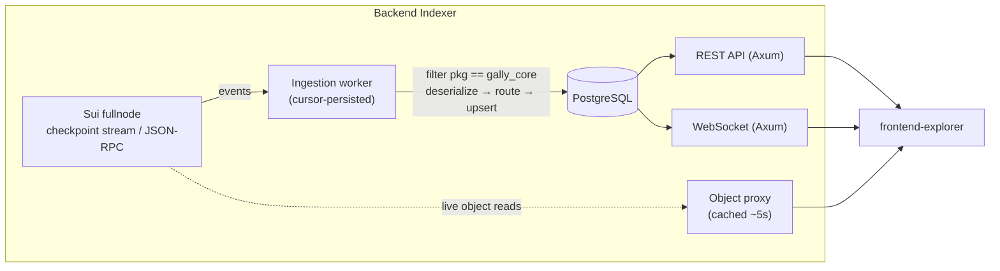
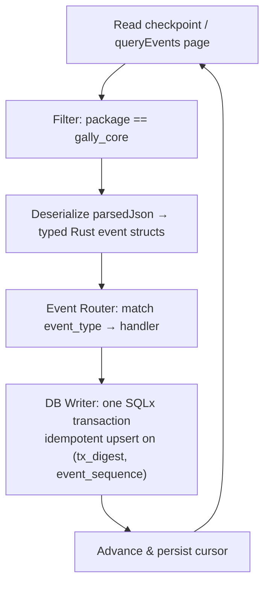

# Gally Backend Indexer

The **read layer** for the Gally protocol. `gally_core` emits events as its only historical record;
this Rust service ingests every one of them into PostgreSQL and serves the history back to the
frontend over a read-only REST + WebSocket API. It also proxies live Sui object reads so the
frontend talks to **one host** that fronts three data sources.

> **Authoritative specs:** `../milestone/backend indexer/backend.md` (purpose, scope, API surface) and
> `../milestone/backend indexer/logic_flow.md` (DB schema, object map, ingestion logic, response
> shapes, **and the binding event reference §10**). Guard rails + status:
> `../milestone/backend indexer/guard_rails.md`.

## What it is — and isn't

- **Is:** a faithful, idempotent projection of on-chain events into queryable tables; a discovery +
  history + time-series + cross-actor-aggregation API; a thin cached object-read proxy.
- **Isn't:** a source of truth (the chain is), a write path (the API is strictly read-only), or an
  authority on current owned-object balances (the frontend reads those from the wallet/RPC directly).

## Where it sits

The object proxy is a **separate lightweight path** — it does not go through the ingestion worker; it
reads live object state from the fullnode on demand and caches briefly.

## Ingestion model

Three properties make this safe to re-run and impossible to corrupt:

- **Monotone & ordered.** Checkpoints are processed in sequence; the cursor is persisted in the DB so
  a restart resumes exactly where it left off.
- **Idempotent.** Re-processing a checkpoint produces identical state — every write upserts on
  `(tx_digest, event_sequence)`. A full replay yields the same DB.
- **No hallucinated state.** Only what an event actually carries is stored; unknown event types are
  logged and archived raw, never dropped or fabricated.

> **Wire reality:** Sui delivers `u64`/`u128` as JSON **strings** and `vector<u8>` as byte arrays, so
> the deserializers are string-aware (`logic_flow.md §10.2`). And the event contract that the code
> implements is `logic_flow.md §10` (transcribed from the shipped Move source) — **not**
> `protocol_flow.md §18`, which has drifted (`backend.md §8`). Source wins.

## What gets indexed

All **36 event families** from `gally_core` are ingested. They fold into purpose-built tables — money
events carry both a **delta** and a **post-action aggregate** (`raised_after`, `total_wrapped_after`,
`index_after`) so time-series are reconstructable without ever re-reading a past object state
(the historical-state rule, `protocol_flow.md §18 P3`):

| Event family | Feeds | Serves |
|---|---|---|
| `AssetCreated`, `AssetStateChanged` | `assets`, `asset_state_changes`, `tranche_schedule` | discovery list, lifecycle timeline |
| `CapitalContributed`, refunds | `raise_progress`, `position_events` | funding curve, holdings |
| `RevenueDeposited`, `Rollover*`, `Compensation*` | `yield_index_series`, `accumulator_balances` | APY/index curve, pool balances |
| `Shares{Wrapped,Unwrapped}` | wrap-ratio series, `position_events` | supply/wrap view |
| tranche proof / approve / release | `tranche_events` | milestone feed |
| `ValidatorRegistered`, stake, status | `validator_pools`, `validator_stake_events`, `validator_status_changes` | validator track record |
| dispute open / vote / resolve / reward | `disputes`, `jury_votes`, `juror_rewards` | dispute detail + jury roll-call |
| `ProtocolParamChanged`, pause | `governance_events` | governance log |
| dust sweep | `dust_sweeps` | terminal reclaim |

Holder ledgers and per-address holdings are **derived on read** from `position_events` (no table) and
are **protocol-attributed** — the indexer tracks the address the protocol credited, which can differ
from the current object owner after a peer-to-peer deed transfer (`backend.md §4.3`).

## API surface (read-only)

REST endpoints (all array endpoints are **keyset-paginated** behind a `{data, nextCursor,
hasNextPage}` envelope; `?limit` default 20, max 100):

| Group | Endpoints |
|---|---|
| Assets | `/assets` · `/assets/:id` · `/assets/:id/{history,raise-progress,yield,wrap-ratio,tranches,disputes,holders,accumulator}` |
| Validators | `/validators` (`?status=`, `?validator=`) · `/validators/:pool_id` |
| Accounts | `/address/:address` · `/portfolio/:address` · `/portfolio/:address/assets` |
| Disputes | `/disputes` (`?verdict=`, `?pool_id=`, `?asset_id=`, `?challenger=`) · `/disputes/:id` |
| Governance | `/governance` |
| Tx / objects | `/tx/:digest` · `/objects/:id` (proxied, cached ~5s) · `/objects/:id/legal-docs` |
| Ops | `/health` (503 past the lag threshold) · `/metrics` (Prometheus) |

WebSocket channels push raw indexed event records as live deltas (the frontend backfills via REST,
then subscribes):

| Channel | Pushes |
|---|---|
| `/ws/assets/:asset_id` | every event for one asset |
| `/ws/portfolio/:address` | every event where the address appears in any actor column |
| `/ws/disputes/:dispute_id` | live jury-vote tally updates |

### The three sources behind one host

The frontend's read layer (`explorer_spec.md §6`) maps onto: **(1)** the indexer DB for
history/series/aggregation; **(2)** the `GET /objects/:id` proxy for current object state (full
`ProtocolConfig`, live `Asset`/`ValidatorPool`/accumulator fields, legal-doc dynamic fields); **(3)**
Walrus, read client-direct and sha256-verified, for document *bytes* (only `blob_id + sha256` live
on-chain). Connected-wallet owned-object balances are read straight from RPC, not from here.

## Stack & layout

Rust · **Tokio** · **Axum** (HTTP + WS) · **SQLx** (runtime-checked, async) · **PostgreSQL** ·
`tracing` · `prometheus` · `sqlx migrate` (applied at startup). The crate is split into `ingestion/`
(loop + per-domain handlers + event structs), `db/` (migrations + models + queries), `api/` (Axum
router + per-resource routes + the object proxy), and `sui_client/` (the thin JSON-RPC/object-proxy
wrapper) — full map in `logic_flow.md §8`.

## Build & test

`cargo build && cargo test`. Configuration is 12-factor (env vars; see `.env.example`) — Sui RPC URL,
Postgres URL, the `gally_core` package id, and the lag-alert threshold. Tests run against a real
Postgres via `sqlx::test` (no DB mocking).
