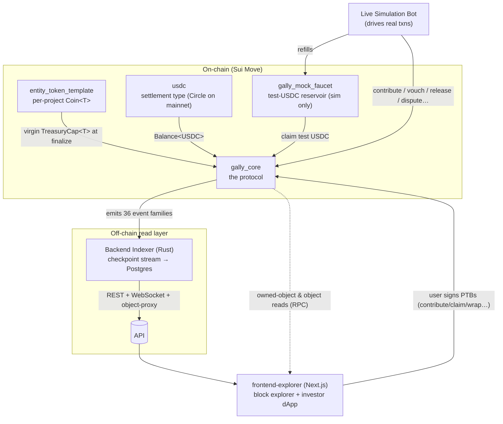

# Gally — Capital Protocol

> A decentralized protocol on **Sui** that lets retail investors pool **USDC** to fund vetted
> real-world projects (housing, machinery, trade finance, agriculture, energy, infrastructure) and
> receive **digital deeds** that pay yield — with milestone-escrowed funding, validator-staked legal
> attestation, and slashing-backed accountability.

Gally turns a real-world cash-flow asset into an on-chain object you can hold, earn from, trade, and
redeem — **without trusting the people who built it**. Capital is released against milestones, the
legal paperwork is vouched by validators who post slashable collateral, and yield is distributed by
an O(1) accounting trick that never loops over holders.

---

## The problem, and the shape of the solution

Real-world-asset (RWA) yield is mostly closed to retail: deals are large, illiquid, and require
trusting an operator to actually pay out. Gally's answer is to make every trust assumption either
**removed** or **collateralized**:

- **Pooled, all-or-nothing funding.** Investors contribute USDC into an on-chain escrow. The raise
  either reaches its goal and converts to deeds, or it fails and every contributor refunds in full.
  Capital is never stranded.
- **Milestone-escrowed release.** A funded project's capital does not go to the builder up front. It
  sits in escrow and is released tranche-by-tranche, each gated by a validator-approved milestone
  proof with a hard deadline. Miss a deadline → default path.
- **The digital deed (`GallyShare`).** 1 share = 1 USDC of principal. It is a freely transferable,
  composable object that carries its own unclaimed-yield accounting with it.
- **Yield by lazy index.** Revenue deposited by the project is split by formula and distributed to
  deed-holders through a single moving index — no per-holder loop, ever.
- **Accountability by stake.** Validators lock USDC per vouch; lying or approving fraud gets them
  slashed and investors compensated. Challengers can open disputes; a validator jury votes.

### The trust thesis, in one line

> **The entity is never trusted. The validator is trusted only up to their locked stake. The admin
> is trusted only with parameters.**

| Actor | Holds | Can do | Trusted with |
|---|---|---|---|
| **Admin** | `AdminCap` | Tune parameters, emergency-pause *entry*, sweep terminal dust | Parameters only — **cannot** touch escrows, mint deeds, or move user funds |
| **Validator** | `ValidatorCap` + `ValidatorPool` | Vouch legals, approve milestones, vote on disputes | Real-world attestation, bounded by slashable USDC stake |
| **Entity** (builder) | `EntityCap` | List a project, submit proofs, withdraw *approved* tranches, deposit revenue | **Nothing** — every privilege is gated by validator approval or preconditions; posts its own collateral |
| **Investor** | `ContributionReceipt` → `GallyShare` → optionally `Coin<T>` | Contribute, refund, claim deeds, claim yield, wrap/unwrap, redeem, dispute | **Nothing** — all paths are permissionless and self-custodial |
| **Challenger** | A posted bond | Open a dispute against an attestation | **Nothing** — bond forfeiture punishes spam |
| **Indexer / Frontend / Bot** | — | Read events and object state | **Nothing** — pure observers; the contract never depends on them |

---

## System architecture

Gally is a monorepo of six cooperating components across three layers. **The chain is the only
IPC** — every component communicates by reading or writing on-chain state and events; no component
calls another's API.

**Reading flow:** `gally_core` emits events → the indexer ingests them into Postgres and serves
REST/WebSocket → the explorer renders history, while live object/owned-object state is read straight
from a Sui fullnode. **Writing flow:** the explorer builds a transaction, the connected wallet signs
it, and it executes against `gally_core` — the explorer never holds keys. The **simulation bot** is
what makes a local/devnet deployment *alive*: it publishes the stack and continuously drives real
protocol transactions so the indexer fills and the explorer animates.

### Monorepo map

| Directory | Role | Stack | Authoritative spec |
|---|---|---|---|
| [`gally_core/`](gally_core) | The protocol: config, validators, asset lifecycle, deeds, yield engine, wrap machine, disputes | Sui Move | `milestone/gally core/protocol_flow.md` |
| [`entity_token_template/`](entity_token_template) | One-shot per-project token package; hands a virgin `TreasuryCap<T>` to the protocol at finalize | Sui Move | `milestone/entity_token_template/template_flow.md` |
| [`usdc/`](usdc) | The settlement coin type `usdc::usdc::USDC` — Circle's real package on mainnet, locally-mintable mock elsewhere | Sui Move | `usdc/` file headers |
| [`gally_mock_faucet/`](gally_mock_faucet) | Shared faucet that vends test USDC (simulation only — never on mainnet) | Sui Move | `milestone/live-simulation/protocol_flow.md §2` |
| [`Backend Indexer/`](Backend%20Indexer) | Ingests every event into Postgres; serves the read API (REST + WebSocket + object proxy) | Rust · Axum · SQLx · Postgres | `milestone/backend indexer/{backend,logic_flow}.md` |
| [`frontend-explorer/`](frontend-explorer) | Public block explorer **and** investor dApp (user-scoped transactions) | Next.js 16 · React 19 · Tailwind v4 | `milestone/frontend explorer/explorer_spec.md` |
| [`Live Simulation Bot/`](Live%20Simulation%20Bot) | Root Simulator: publishes the stack and drives continuous real activity | Rust | `milestone/live-simulation/{docs,protocol_flow}.md` |

---

## Core economic mechanics

Everything below is normative in `protocol_flow.md`; this is the intuition.

### 1 share = 1 USDC, all-or-nothing

A project's `funding_goal` is **also its exact total deed supply**. During funding, contributors hold
soulbound `ContributionReceipt`s (a transferable claim on still-refundable money would be a free
option, so deeds do not exist yet). Finalize converts receipts to deeds 1:1; abort refunds them 1:1.
Overshoot is capped at the goal and the excess refunded in the same call.

### The lazy yield index (O(1) distribution)

When a project deposits revenue, the contract routes the investor portion into a single global index
instead of looping over holders. For unwrapped supply $u = \text{minted} - \text{wrapped}$ and an
investor portion $P$:

$$\Delta\text{index} = \frac{P \times \text{SCALE}}{u}, \qquad \text{SCALE} = 10^{9}$$

Each deed stores a personal snapshot of the index at its last claim. Yield owed is always derivable,
so transferring the deed transfers exactly its unclaimed yield with it:

$$\text{payout} = \frac{(\text{index}_{\text{global}} - \text{index}_{\text{personal}}) \times \text{share\_count}}{\text{SCALE}}$$

All index math is `u128`, scaled by `SCALE`, **multiply-before-divide**, flooring in the protocol's
favor (truncation dust stays in the reward pool as a solvency buffer). This is what lets the protocol
**never loop over holders** — a hard invariant in every code path.

### The wrap machine and the Diamond-Hand multiplier

A deed can be **wrapped** into a vanilla `Coin<T>` (burn the deed, mint the coin) for full DeFi
composability — instantly listable on a DEX, usable as collateral. Unwrapping reverses it. The coin's
total supply always equals `total_wrapped_shares`, because the only `TreasuryCap<T>` lives *inside*
the protocol's accumulator forever and the only mint path is wrapping.

The catch: **only unwrapped deeds earn yield** — the index denominator $u$ counts unwrapped supply
only. So as more holders wrap (chase liquidity), the remaining unwrapped holders earn a larger slice:

$$\text{yield share per unwrapped deed} \propto \frac{1}{u} \uparrow \quad\text{as wrapped supply}\uparrow$$

This "Diamond-Hand multiplier" is **emergent, not a parameter** — liquidity and yield are a deliberate
trade-off the holder chooses. (Detail: [`Opportunity Cost Yield Multiplier.md`](Opportunity%20Cost%20Yield%20Multiplier.md).)

### Milestone-tranche escrow, staking, and disputes

- **Tranches.** Funded capital is released in sequence, each tranche gated by an entity-submitted
  proof, a validator approval, and a hard deadline. A missed deadline is a machine-checkable default.
- **Validator coverage.** A validator locks `vouch_coverage_bps` of a project's goal per vouch; that
  locked stake is the cap on their loss for that project and what compensates investors if they lied.
- **Disputes.** Anyone can post a bond to challenge a vouch; a jury of *other* eligible validators
  votes **one-pool-one-vote** (sybil-resistant), and a guilty verdict above the threshold slashes the
  target and routes restitution — through a grace window so even wrapped holders can unwrap and be
  made whole first.
- **Asymmetric pause.** Emergency pause halts capital **entry** (contribute, wrap, create, release,
  deposit) but **never** capital **exit** (claim, refund, unwrap, redeem). A protocol that can trap
  user funds under an admin flag is not trustless.

---

## The asset lifecycle

`Asset.state` and every legal transition (any transition not drawn here is forbidden and aborts):

```mermaid
stateDiagram-v2
    [*] --> PENDING_VOUCH : create_asset (entity)
    PENDING_VOUCH --> FUNDING : vouch_asset_legals (validator locks coverage)
    PENDING_VOUCH --> CANCELLED : cancel_unvouched

    FUNDING --> FUNDED : finalize_successful_raise (anyone; raised == goal)
    FUNDING --> FAILED : abort_failed_raise (anyone; deadline passed, short)
    FAILED --> [*] : all receipts refunded

    FUNDED --> EXECUTING : tranche engine armed at finalize
    EXECUTING --> EXECUTING : release_funding_tranche (validator-approved, sequential)
    EXECUTING --> OPERATIONAL : final tranche released
    EXECUTING --> DEFAULTED : flag_default (anyone; tranche deadline missed)

    OPERATIONAL --> OPERATIONAL : deposit_revenue / claim / wrap / unwrap
    OPERATIONAL --> CLOSED : close_asset (terminal distribution complete)

    DEFAULTED --> COMPENSATING : entity collateral + residual escrow seized
    COMPENSATING --> CLOSED : grace over, funds swept, redemptions open
```

For **every** state that holds user funds at risk, at least one permissionless, non-pausable exit
exists (abort/refund, claim, unwrap, sweep, redeem) — the protocol's central safety invariant.

---

## Run the stack

Two orchestrators bring up the whole system end to end:

- **Local node:** `./run_stack.sh` — fresh local Sui chain, publishes `usdc` + `gally_core` +
  `gally_mock_faucet` + token templates, starts Postgres + the indexer, seeds genesis, and runs the
  activity bot so the explorer comes alive.
- **Official Devnet:** `./run_devnet.sh` — same bring-up against Sui Devnet (operator-funded gas,
  dynamic gas throttling), preserving the mainnet→Circle USDC mapping.

Per-component build/test:

| Component | Commands |
|---|---|
| `gally_core` (Move) | `cd gally_core && sui move build && sui move test` |
| `gally_mock_faucet` (Move) | `cd gally_mock_faucet && sui move build && sui move test` |
| `Backend Indexer` (Rust) | `cd "Backend Indexer" && cargo build && cargo test` |
| `Live Simulation Bot` (Rust) | `cd "Live Simulation Bot" && cargo build && cargo test` |
| `frontend-explorer` (Next.js) | `cd frontend-explorer && pnpm typecheck && pnpm lint && pnpm build && pnpm test && pnpm test:e2e` |

See each component's README for its own runbook; the simulation bot's
[`README`](Live%20Simulation%20Bot/README.md) is the full operator runbook.

---

## Where the truth lives

The `milestone/` directory holds the authoritative specifications — code conforms to them, and they
are amended *before* code deviates. Start with:

| To understand… | Read |
|---|---|
| The protocol (objects, flows, math, invariants, events, errors) | `milestone/gally core/protocol_flow.md` |
| The per-project token handoff | `milestone/entity_token_template/template_flow.md` |
| The indexer (schema, API, event reference) | `milestone/backend indexer/backend.md` + `logic_flow.md` |
| The explorer (scope, routes, data tiers) | `milestone/frontend explorer/explorer_spec.md` |
| The live simulation harness | `milestone/live-simulation/docs.md` |
| The documentation effort itself | `milestone/docs/docs_plan.md` |

## Status

As of 2026-06, every track is feature-complete with green test suites — protocol (`gally_core`
M1–M8), per-entity token, backend indexer (BI-M1–M8), frontend explorer (FE-M1–M8b, live read +
wallet-RPC + live execution), and the live-simulation bot (through Devnet onboarding, DEV-M1). The
remaining work toward production is a real-Walrus document layer and a mainnet publish. Per-track
status lives in each track's `guard_rails.md` and the git history (the single source of truth for
"what's done"); this README does not duplicate it.
