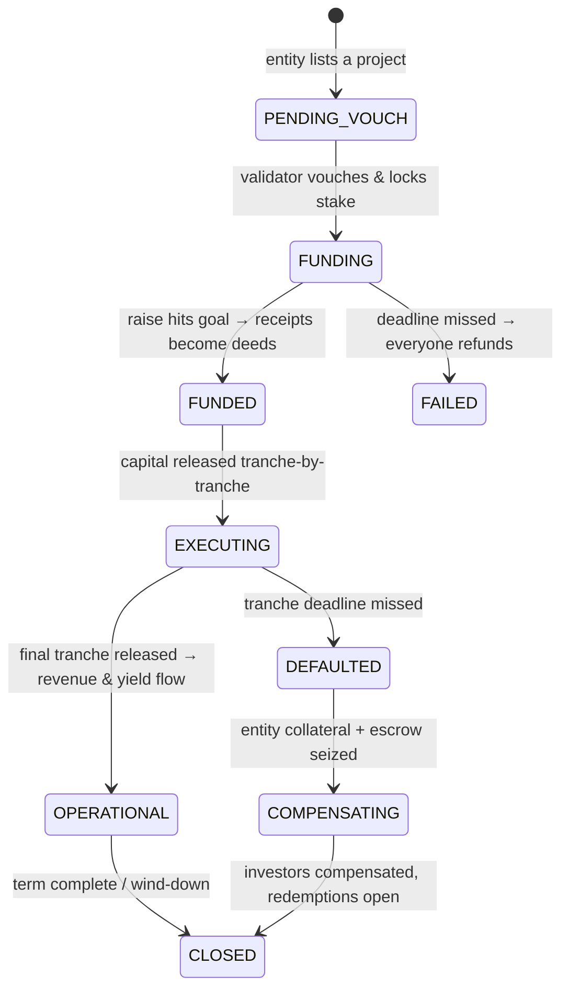
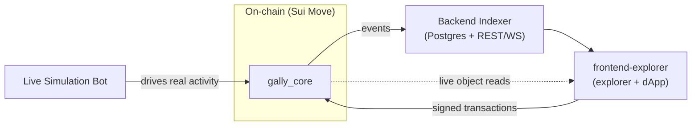

# Gally — Capital Protocol

> A decentralized protocol on **Sui** that lets retail investors pool **USDC** to fund vetted
> real-world projects (housing, machinery, trade finance, agriculture, energy, infrastructure) and
> receive **digital deeds** that pay yield — with milestone-escrowed funding, validator-staked legal
> attestation, and slashing-backed accountability.

This is the repo-level summary: **why Gally exists, how the deeds and yield math work, and how to
run it.** Each component has its own README with the deep detail.

---

## Why it exists

Real-world-asset (RWA) yield is mostly closed to retail: deals are large, illiquid, and require
*trusting an operator* to actually pay out. Gally makes every trust assumption either **removed** or
**collateralized**, so ordinary investors can fund real projects and earn from them safely.

- **Pooled, all-or-nothing funding.** Investors contribute USDC into an on-chain escrow. The raise
  either reaches its goal and converts to deeds, or it fails and **everyone refunds in full** —
  capital is never stranded.
- **Milestone-escrowed release.** A funded project's money is **not** handed to the builder up front.
  It sits in escrow and is released tranche-by-tranche, each one gated by a validator-approved proof
  with a hard deadline. Miss a deadline → default & compensation path.
- **Accountability by stake.** Validators lock USDC to vouch for a project's legals; lying or
  approving fraud gets them **slashed** and investors compensated. Anyone can post a bond to dispute
  a vouch, and a jury of other validators votes on it.
- **Self-custody, always.** Every investor action is permissionless. Even under an emergency pause,
  exits (refund, claim, unwrap, redeem) **always** work — the protocol can never trap your funds.

> **Trust thesis in one line:** the *entity* is never trusted, the *validator* is trusted only up to
> their locked stake, and the *admin* is trusted only with parameters — never with your money.

---

## How deeds & yield work (the math)

### The digital deed — `GallyShare`

When a raise succeeds, your contribution becomes a **deed**: a transferable, composable on-chain
object where **1 share = 1 USDC of principal**. A project's funding goal *is* its total deed supply,
which is what keeps share accounting exact. Each deed carries its own unclaimed-yield bookkeeping, so
selling or transferring it moves exactly its pending yield with it.

### Yield by lazy index (no loops, ever)

When a project earns money it deposits gross revenue; the contract automatically routes the
investors' cut into a single **global index** instead of iterating over holders. For an investor
portion $P$ and current unwrapped supply $u$:

$$\Delta\text{index} = \frac{P \times \text{SCALE}}{u}, \qquad \text{SCALE} = 10^{9}$$

Each deed remembers the index value at its last claim, so what you're owed is always just the
difference since then:

$$\text{payout} = \frac{(\text{global index} - \text{personal index}) \times \text{share count}}{\text{SCALE}}$$

All of this is `u128` fixed-point, **multiply-before-divide**, and floors in the protocol's favor —
the rounding dust stays in the reward pool as a solvency buffer, so the pool always covers what it
owes.

### Wrapping & the Diamond-Hand multiplier

A deed can be **wrapped** into a plain `Coin<T>` (burn the deed, mint the coin) for full DeFi
liquidity — instantly tradable on a DEX or usable as collateral — and **unwrapped** back. The coin's
supply can never exceed wrapped deeds, because the only mint authority lives *inside* the protocol
forever and the only way to mint is to wrap.

The trade-off: **only unwrapped deeds earn yield.** The index denominator $u$ counts unwrapped supply
only, so as more holders wrap (chase liquidity), the remaining unwrapped holders each earn a *bigger*
slice — an emergent reward for staying in, not a tunable parameter:

$$\text{yield per unwrapped deed} \;\propto\; \frac{1}{u} \;\uparrow\quad\text{as wrapped supply}\uparrow$$

### The deed's lifecycle (a little flow)

Every state that holds funds at risk has a permissionless, never-pausable exit (refund, claim,
unwrap, sweep, redeem).

---

## How to use it

As an **investor** you contribute to a `FUNDING` project, claim your deeds when it funds, claim yield
while it operates, optionally wrap/unwrap for liquidity, and refund or redeem to exit. As a
**challenger** you can dispute a validator's vouch by posting a bond. All of this is done from the
explorer with a connected wallet — the app builds the transaction, your wallet signs it, and it never
holds your keys.

Bring the whole stack up end-to-end with one command:

| Target | Command |
|---|---|
| Local Sui node | `./run_stack.sh --soak 40` |
| Official Sui Devnet | `./run_devnet.sh` |

Each publishes the contracts, starts the indexer, seeds demo data, and runs an activity bot so the
explorer fills with live, continuously-updating data. See each component's README for its own runbook.

---

## What's in this repo

Gally is a monorepo of cooperating components across three layers. **The chain is the only IPC** —
components talk only by reading/writing on-chain state and events; none calls another's API.

| Directory | Role |
|---|---|
| [`gally_core/`](gally_core) | The protocol: config, validators, asset lifecycle, deeds, yield engine, wrap machine, disputes |
| [`entity_token_template/`](entity_token_template) | One-shot per-project token package; hands a virgin mint authority to the protocol at finalize |
| [`usdc/`](usdc) | The settlement coin type `usdc::usdc::USDC` — Circle's real USDC on mainnet, a mintable mock elsewhere |
| [`gally_mock_faucet/`](gally_mock_faucet) | Shared faucet that vends test USDC (simulation only — never on mainnet) |
| [`Backend Indexer/`](Backend%20Indexer) | Ingests every event into Postgres; serves the read API (REST + WebSocket + object proxy) |
| [`frontend-explorer/`](frontend-explorer) | Public block explorer **and** investor dApp |
| [`Live Simulation Bot/`](Live%20Simulation%20Bot) | Publishes the stack and drives continuous real activity so the explorer comes alive |

Per-component build/test:

| Component | Commands |
|---|---|
| `gally_core` / `gally_mock_faucet` / `usdc` (Move) | `sui move build && sui move test` |
| `Backend Indexer` / `Live Simulation Bot` (Rust) | `cargo build && cargo test` |
| `frontend-explorer` (Next.js) | `pnpm typecheck && pnpm lint && pnpm build && pnpm test` |

## Status

As of 2026-06, every component is feature-complete with green test suites — the protocol, the
per-entity token, the backend indexer, the frontend explorer (live read + wallet transactions), and
the live-simulation bot (through Sui Devnet onboarding). Remaining toward production: a real document
(Walrus) layer and a mainnet publish.
