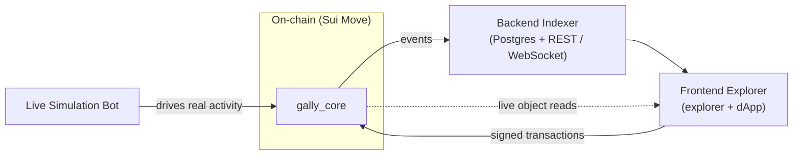

# System Architecture

Gally is a set of cooperating components, but they are deliberately decoupled: **the chain is the only
inter-process communication.** No component calls another's API. Each one only reads from or writes to
on-chain state and events. That means any piece can be restarted, replaced, or scaled independently,
and the protocol never depends on an off-chain service being up.

## The components

| Component | Built with | Role |
|---|---|---|
| **`gally_core`** | Sui Move | The protocol itself: config & governance, validators, the asset lifecycle, deeds, the yield engine, the wrap machine, and disputes. |
| **`entity_token_template`** | Sui Move | A one-shot package each project publishes to create its own token, handing a *virgin* mint authority to the protocol at finalization. |
| **`usdc`** | Sui Move | The settlement coin type. Real Circle USDC on mainnet; a mintable mock on test networks. |
| **`gally_mock_faucet`** | Sui Move | A shared faucet that vends test USDC — simulation only, never on mainnet. |
| **Backend Indexer** | Rust + Postgres | Ingests every protocol event into a database and serves a read API. |
| **Frontend Explorer** | Next.js | The public block explorer and the investor dApp. |
| **Live Simulation Bot** | Rust | Publishes the stack and drives continuous, realistic activity so the explorer fills with live data. |

## The data path

- **Writes** flow one way: a user (or the bot) signs a transaction in their wallet, which mutates
  `gally_core` on-chain.
- **Reads** flow back: the protocol emits an event for every state change; the indexer ingests those
  events into Postgres and serves them over REST and WebSocket. The explorer reads mostly from the
  indexer, and reads live objects directly from the chain where it needs the absolute latest state.
- **Nothing is trusted off-chain.** The indexer and explorer are pure observers — the contract never
  depends on them, and they hold no authority.

## The indexer

Because object reads only ever return *current* state, the protocol carefully designs its **events** to
carry everything needed to reconstruct history. The indexer ingests every event family into typed
Postgres tables (idempotently, so replays are safe) and serves the explorer's lists, charts, portfolio
feeds, validator track records, and dispute tallies — plus a WebSocket push for live updates and an
object-proxy for fetching live object and document state. Its data contract is documented in the
indexer's own README.

## The settlement coin & the per-entity token

Two token concerns are kept separate:

- **USDC** is the money everyone pools and gets paid in. It resolves per environment: real Circle USDC
  on mainnet, a locally-mintable mock elsewhere — but always at the same module path, so the protocol
  code is identical across networks.
- **Each project's token** comes from its own one-shot package. At finalization the project hands the
  protocol a *virgin* mint authority (zero existing supply, 6-decimal parity with USDC), which the
  protocol then custodies **forever**. This is what guarantees the wrapped coin's supply can never
  exceed wrapped deeds.

## The live-simulation harness

A brand-new deployment is empty — no projects, no validators, no activity — which makes it impossible
to *see* the protocol work. The simulation harness fixes that. The faucet vends test USDC, and the bot
publishes the stack, seeds a realistic spread of projects across every lifecycle state, and then runs a
continuous activity loop (contributions, approvals, revenue, wraps, disputes) so the explorer comes
alive with live, evolving data. It runs no web server of its own — true to "the chain is the only IPC,"
it talks to everything else only through on-chain transactions.

> Mintable USDC and the faucet are **test-network properties only**. On mainnet, USDC is the real asset
> and the faucet does not exist.
