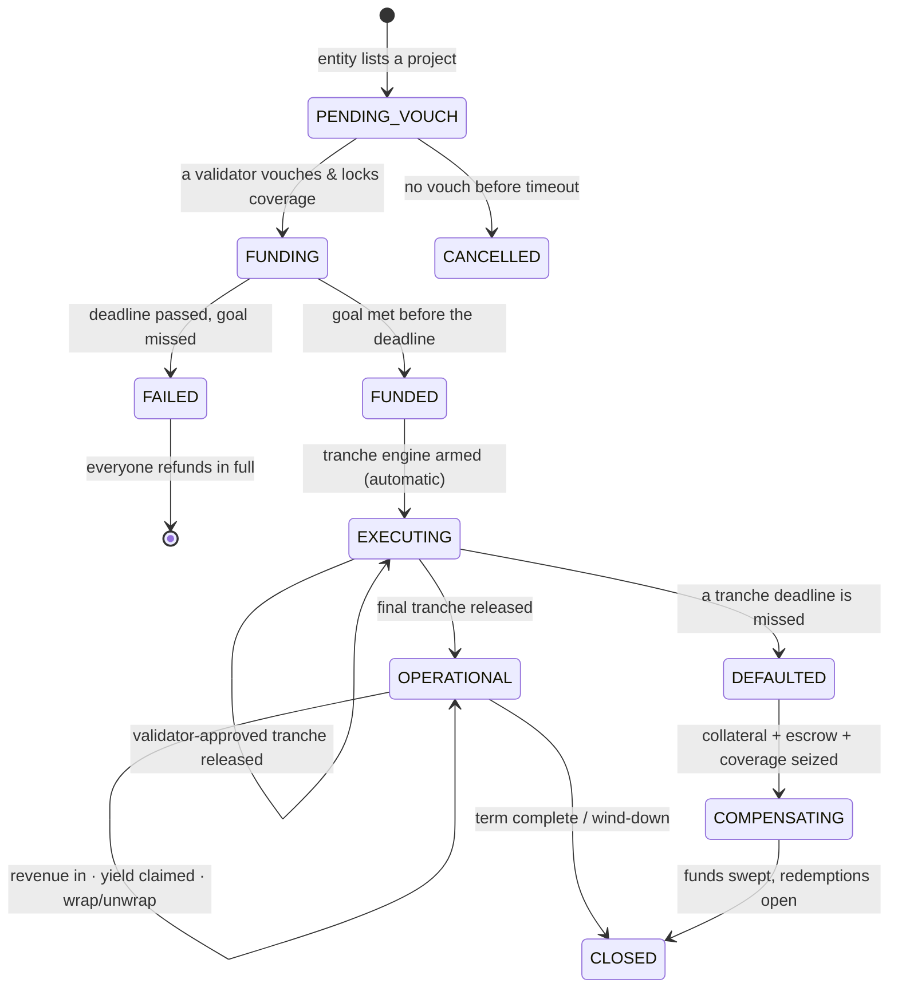

# The Asset Lifecycle

Every Gally project is a state machine. A project moves through a fixed set of states, and **only the
transitions drawn below are allowed** — anything else is rejected by the contract. Understanding this
diagram is the fastest way to understand the whole protocol, because every action belongs to exactly
one state.

## The lifecycle at a glance

## Each state, in plain words

- **`PENDING_VOUCH`** — the entity has listed the project (its goal, tranche schedule, revenue split,
  and its own collateral), but no validator has vouched yet. Nobody can contribute. If no validator
  vouches within a timeout, the listing can be **cancelled** and the entity's collateral returned.
- **`FUNDING`** — a validator has vouched and locked coverage; the raise is open. Investors contribute
  USDC and receive soulbound receipts. This continues until the goal is met or the deadline passes.
- **`FAILED`** — the deadline passed without hitting the goal. The raise is dead and every contributor
  can **refund their full principal**. This is the all-or-nothing guarantee.
- **`FUNDED` → `EXECUTING`** — the goal was met and the raise finalized. The funds stay in escrow and
  are released **tranche-by-tranche**: the entity submits proof, a validator approves it, then the
  entity withdraws that tranche. Releasing the final tranche flips the project to operational.
- **`OPERATIONAL`** — the project is live and earning. Revenue is deposited (by anyone), the
  investors' cut flows into the yield index, and holders claim yield, sell deeds, or wrap/unwrap at
  will.
- **`DEFAULTED` → `COMPENSATING`** — a tranche deadline was missed. Anyone can flag it; the project's
  collateral, undeployed escrow, and the validator's coverage (if a related dispute was upheld) are
  seized into a compensation pool, distributed to holders after a grace window.
- **`CLOSED`** — the terminal state. A project closes when a term-financing target is reached,
  after compensation is fully distributed, or via an agreed wind-down. Deeds can still be redeemed and
  any final yield claimed.
- **`CANCELLED`** — a listing that was never vouched and timed out; collateral returns to the entity.

## "Where is my money, and how do I get out?"

The single most important property of the lifecycle is that **every state holding your money has a
permissionless exit that is never pausable.**

| State | Where your capital is | How you exit |
|---|---|---|
| `PENDING_VOUCH` | nothing raised yet | — |
| `FUNDING` | the project's escrow | guaranteed by the abort-and-refund path if the raise fails |
| `FAILED` | the project's escrow | **refund your full principal** (always available) |
| `EXECUTING` | escrow (unreleased) + entity (released) | none by design — capital is deployed; protected by validator coverage + entity collateral |
| `OPERATIONAL` | flowing through the accumulator | **claim yield**; sell, transfer, or **unwrap** your deed any time |
| `DEFAULTED` / `COMPENSATING` | the compensation pool | **pro-rata compensation** — unwrap during the grace window, then claim |
| `CLOSED` | residual dust only | **redeem** your deed (claims any final yield, then burns it) |

The only state with no exit is `EXECUTING`, and that is intentional: the money is doing the real-world
work it was raised for. Your protection there is not an exit button — it is the validator's slashable
coverage and the entity's collateral standing behind the project. See
[Trust & Security](/docs/security) for why that is enough.
