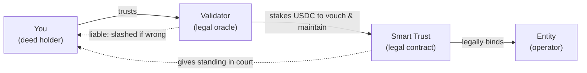
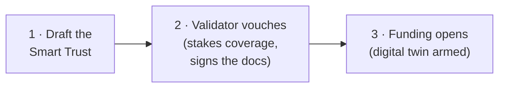

# The Smart Trust

A smart contract can move USDC, but it cannot pour concrete, sign a lease, pay payroll tax, or stand
in a courtroom. Real-world assets are operated by people in a legal jurisdiction. So Gally's security
is **dual-layer**:

- **On-chain (code):** escrow, milestone gates, never-pausable exits, slashing, the yield engine — the
  mathematical certainty covered across the rest of these docs.
- **Off-chain (courts): the Smart Trust** — a physical, legally binding, court-enforceable contract
  that ties the operating entity and the real asset to your deeds.

Your `GallyShare` deed is not just a number on a screen. It is a cryptographically secure receipt for a
**legally defensible** claim. This page explains that legal half.

## What the Smart Trust is

The **Smart Trust** is the master legal contract for a project. It is drafted before funding opens and
it dictates the real-world terms that the on-chain protocol then enforces and mirrors:

- **Ownership & governance** — what a deed legally entitles you to, and the **voting rights** of
  holders over the asset's major decisions. (These rights are defined and exercised in the legal layer;
  the protocol does not run an on-chain holder vote.)
- **The terms binding the entity** — exactly what the operator must do, by when, and to what standard.
- **Operation & maintenance** — how the asset is run, maintained, insured, and kept in good standing.
- **Economics** — how revenue is shared, how fees and **taxes** are handled, and what happens at
  wind-down or sale.
- **Acquisition & lifecycle** — how the underlying asset is acquired, held, and ultimately disposed of.
- **Compliance** — the local, state, and federal rules that legally tie the asset (and the entity) to
  the tokens, giving holders **standing**: anyone with a deed has a basis to act in a real court.

In short: the Smart Trust is *why* the token means something off-chain.

## How it lives on-chain — the digital twin

The full legal contract lives off-chain (on Walrus decentralized storage). What the protocol holds is
its **binding reference**: the document set plus each document's **`SHA-256` content hash**, attached
to the on-chain Asset and **cryptographically signed by a validator**. Because the hash is pinned,
nobody can quietly swap the document behind it — any change is detectable and traceable to the
validator who signed it.

This is why the on-chain numbers are not arbitrary. The funding goal, the **tranche schedule**, the
**revenue split**, and the closure terms are the **digital twin** of the Smart Trust — a faithful
mathematical reflection of legally agreed terms, not figures an operator typed into a form.

## The trust chain — you trust the validator, not the entity directly

This is the key mental model, and it is the opposite of "code is law":

- You do **not** have to blindly trust the operating entity. You extend trust to the **entity** *because
  a validator has staked their own capital to vouch for — and keep maintaining — the legal strength of
  the Smart Trust.*
- You trust the **validator** because they are **financially liable**: if the Smart Trust is weak,
  breached, or falls out of compliance, their stake is slashable.
- The entity is therefore **legally bound and computationally restricted** — trusted to operate the real
  asset, with that trust secured by **code + collateral + courts**, never by goodwill.

## The validator's real job

A validator is a **decentralized legal oracle**, not a box-ticker. Vouching for a project means staking
USDC to attest that the asset is bound by a robust Smart Trust — legally sufficient and compliant — and
then **keeping that attestation true** as the world changes. If local laws shift and the documents
aren't updated to match, the attestation has gone stale ("legal rot"), and that is a slashable failure.

## How the Smart Trust is enforced

Enforcement runs on both layers, in parallel:

- **On-chain:** missing a milestone deadline lets anyone flag a default that seizes the entity's
  collateral and undeployed escrow; a successful **dispute** against a validator slashes their coverage.
  See [Trust & Security](/docs/security).
- **Off-chain:** because the Smart Trust legally names the entity and binds it to the deeds, holders
  have **standing to pursue remedies in a real court** if the physical contract is breached.

## Disputes reach the legal layer

The [dispute engine](/docs/security) is not only for missed deadlines or faked milestones. Because a
validator's vouch is a financial signature over the Smart Trust's legal strength, a dispute can
challenge that strength directly — for example, the physical contract fails to deliver what it
promised, or the law changed and the validator never updated the documents. This is what makes disputes
powerful: they police the **legal integrity** of the asset, not just its on-chain bookkeeping.

## Where it sits in a project's life

Origination starts with the law, not the code:

From there the project follows [the lifecycle](/docs/lifecycle): funding → milestone-gated execution →
operation → close.

## A measured promise

Gally provides the **mathematical infrastructure**; **local courts provide the legal enforcement**. The
strength of any Smart Trust ultimately depends on the jurisdiction it lives in and on real-world legal
process — which is exactly why validators are bonded to keep it sound, and why we state the limits of
this plainly in [Trust & Security → Honest Limitations](/docs/security). What Gally guarantees on-chain
is that misbehavior is slashable and your capital is always exitable or compensated.
