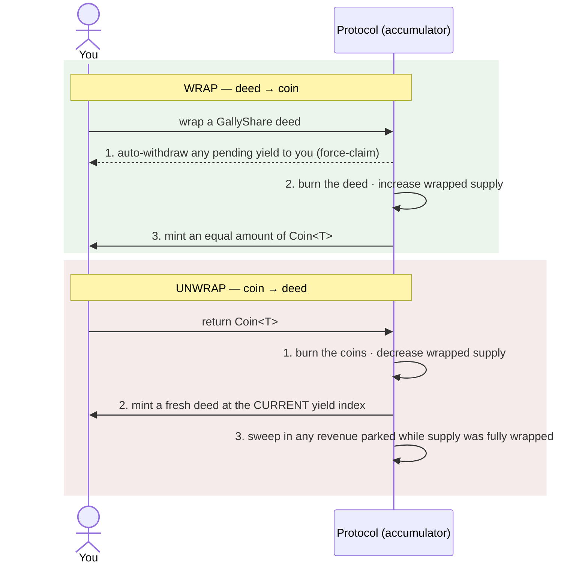

# Wrapping, Liquidity & Collateral

Gally answers a hard question: *how can a custom, yield-bearing real-world asset also work like a normal
DeFi token?* The answer is the **wrapping machine** — a one-to-one bridge that lets you flip your
position between two forms depending on whether you want **yield** or **liquidity**. This page is the
complete picture: the mechanism, the rules around it, what each form is for, and why the wrapped coin is
collateral a lender can actually trust.

## The two states of your position

At any moment your position is in exactly one of two forms, and you choose which:

| | **Deed — `GallyShare` (unwrapped)** | **Coin — `Coin<T>` (wrapped)** |
|---|---|---|
| What it is | An owned Sui object with its own yield bookkeeping | A standard, plain `sui::coin` token |
| Earns yield? | **Yes** — counted in the yield index | **No** — excluded while wrapped |
| Liquidity / composability | Limited (a custom object) | **Full** — trades and integrates like any coin |
| What it's for | Holding to earn the project's revenue | Trading, lending collateral, payments, LPs |
| The trade-off | Earns yield, less liquid | Fully liquid, forfeits yield |

Neither form is "better" — they serve different goals. The whole design lets you move between them
freely and without penalty.

## How wrapping works

The bridge is **burn-on-wrap, mint-on-unwrap** at a strict **1:1** rate. There are no price oracles —
one share is always one coin unit, and one coin unit always redeems to one share.

### Yield is withdrawn automatically when you wrap

You never lose unclaimed yield by wrapping. **Step one of every wrap is a force-claim**: any yield your
deed had accrued is paid out to you *before* the deed is burned. This matters because a wrapped coin is
ineligible for yield — so the protocol settles your history first, automatically, rather than letting it
strand. You don't have to remember to claim before wrapping; it's built in.

### Unwrapping mints a fresh deed at the current index

When you unwrap, you get a brand-new deed whose yield clock is set to the **current** index. That single
rule is what guarantees **zero retroactive yield** for the time your position spent wrapped — by
construction, regardless of timing. The same step also sweeps in any revenue that was parked while
everything was wrapped, so the first holder to unwrap shares in it. The math is in
[The Economic Model](/docs/economics).

## What you let go of — and what you gain

- **Wrapping, you give up yield eligibility.** While wrapped, your coins earn none of the project's
  revenue. That yield doesn't vanish — it flows to the holders who stayed unwrapped.
- **Wrapping, you gain full liquidity and composability.** The coin is a vanilla token with no custom
  logic, so it works *everywhere* a normal coin does, instantly.
- **Unwrapping, you give up liquidity** (it's a custom object again) **and regain yield eligibility** —
  with no penalty for the time spent wrapped.

## The conditions and rules around wrapping

Wrapping is powerful, so a few precise rules govern it:

- **You can always unwrap.** Unwrapping is a protected exit — it is **never** blocked by an emergency
  pause. Wrapping (an entry action) *can* be paused, but unwrapping cannot.
- **A short cooldown** applies between wrapping and unwrapping. It's defense-in-depth against rapidly
  oscillating supply around a known large deposit; for normal use you'll never notice it.
- **Wrap part of a position** by splitting your deed first, then wrapping the piece — your position
  doesn't have to be all-or-nothing. (Unwrapping any amount is natural, since coins are fungible.)
- **During a compensation grace window, wrapping is frozen.** After a slashing or default, the protocol
  freezes wrapping and opens a window so *everyone* can unwrap and become eligible for the
  compensation payout — wrapped holders are never excluded from principal restitution. Unwrapping stays
  open throughout.
- **The peg can never drift.** The amount of `Coin<T>` in existence always equals the number of wrapped
  deeds — never more. This is enforced, not assumed (see below).

## What the wrapped coin is for

Because `Coin<T>` is an ordinary Sui coin, it plugs into the whole ecosystem with no special handling:

- **Trading on a DEX.** List it or swap it on an automated market maker, or provide it as liquidity in a
  pool to earn trading fees.
- **Lending and borrowing.** Deposit it into a money market as **collateral** to borrow stablecoins, or
  supply it to earn lending interest. This is the classic use case: you need cash but don't want to sell
  your position — wrap, borrow against the coin, and unwrap later to keep your exposure.
- **Payments and composability.** Send it, escrow it, or use it as a building block in any other
  protocol that accepts standard coins.

This is the **liquidity** half of Gally's promise: a real-world-asset position that you can actually
*use* in DeFi, not a locked certificate.

## Why it's collateral a lender can trust

A lender only accepts collateral they can value and redeem with confidence. The wrapped coin earns that
confidence because the bridge back to the underlying asset is **contractually binding**, not a promise:

- **The only way to create the coin is to wrap a real deed.** The mint authority lives *inside* the
  protocol forever; nobody — not the team, not the project, not an admin — can mint coins any other way.
- **Supply is pinned to backing.** Total coin supply always equals wrapped deeds, so every coin is
  backed one-to-one by a real position in the underlying project.
- **Redemption is permissionless and unconditional.** Anyone holding the coin can unwrap it back into a
  yield-earning deed at any time, at 1:1, with no oracle and no gatekeeper.

So a coin isn't a synthetic IOU whose value depends on trusting an issuer — it is a faithful, redeemable
claim on the actual asset. And the deed it redeems to is itself a legally-backed claim under the asset's
[Smart Trust](/docs/smart-trust), so the collateral is sound on both layers — code *and* courts. A
lending market can treat it as exactly that. That contractual binding is the difference between "a token
that represents an asset" and "a token you can responsibly lend against."

## Staying unwrapped pushes your APY up

Here's the elegant part. Because only **unwrapped** deeds earn yield, every deposit's investor cut is
divided among unwrapped holders alone. So as others wrap their deeds to chase liquidity, the pool of
yield-earning holders shrinks and **each remaining unwrapped holder's effective APY rises**:

$$\text{your yield per deed} \;\propto\; \frac{1}{\text{unwrapped supply}} \;\uparrow \quad\text{as others wrap}$$

This "Diamond-Hand multiplier" isn't a setting anyone controls — it falls straight out of the yield
math. It rewards conviction: holders who stay in earn the yield that liquidity-seekers give up. In the
limit, if everyone else wraps, you receive essentially the entire investor portion of every deposit.
The full derivation lives in [The Economic Model](/docs/economics).

## So: wrap, or hold?

There's no wrong answer — it's your call based on what you need right now:

| Wrap when… | Stay unwrapped (hold) when… |
|---|---|
| You need liquidity or cash today | You want the project's yield |
| You want to trade, LP, or borrow against it | You believe in the project long-term |
| You're happy to forgo yield temporarily | You want your APY amplified as others wrap |

And whenever your situation changes, flip back — unwrapping is always open, always 1:1, and never costs
you retroactive yield. For the click-by-click steps, see the [Investor Guide](/docs/guides/investor).
