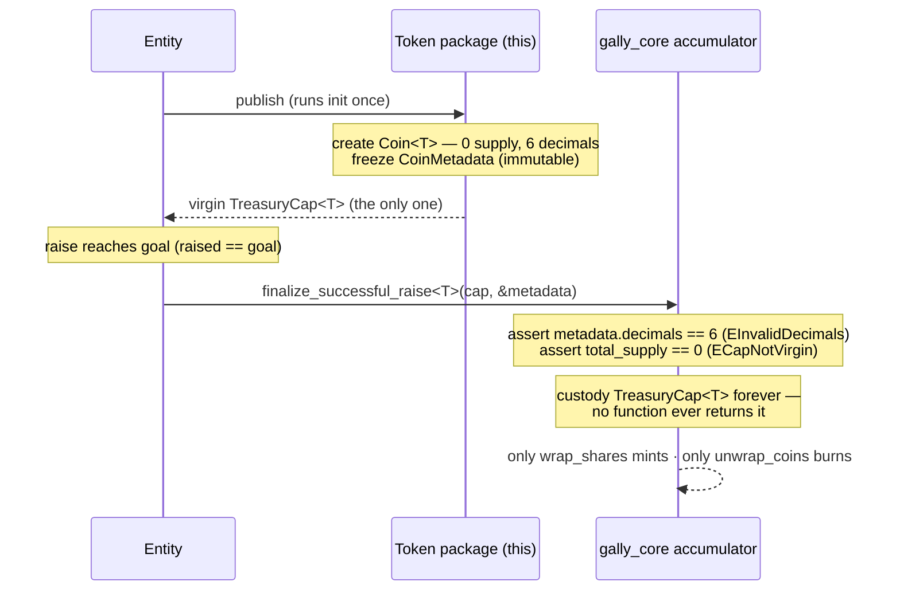

# entity_token_template — per-entity token package

A one-shot Sui Move package that each funded Gally entity publishes for its own
deed token. On publish it creates the asset's fungible `Coin<T>` with **zero
supply** and **6 decimals**, **freezes** the `CoinMetadata` (immutable forever),
and sends the **virgin `TreasuryCap`** to you — which you then hand to
`gally_core::asset::finalize_successful_raise<T>`. After that, the protocol's
wrap machine is the *only* thing that can ever mint or burn this coin.

> **Canonical spec:** `milestone/entity_token_template/template_flow.md`
> (decisions T1–T7, invariants I-T1–I-T5). This README is the operator runbook;
> the spec is the source of truth. **Never change `DECIMALS` (6).** It is
> enforced on-chain at finalize (`EInvalidDecimals`).

## The mechanic: virgin cap, one-way handoff

A Move one-time witness (OTW) must be a struct whose name equals its module name
uppercased — so a *generic* on-chain token factory is impossible. Each entity
therefore publishes its **own copy** of this package, and the unique cap it
produces is handed to the protocol once and custodied **forever**. After the
handoff, the protocol's wrap machine is the sole mint/burn authority, which is
what keeps `Coin<T>` total supply equal to wrapped shares (`gally_core` I-W1).



## Prerequisites

- Sui CLI installed; an active address with gas (`sui client active-address`,
  `sui client gas`).
- The deployed `gally_core` package id, and your funded `Asset` object id (the
  raise must have reached `raised == goal`, state `FUNDING`).
- GNU sed (Linux / WSL) to run the generator. On macOS use `gsed` or WSL.

## 1. Instantiate your package

A Move one-time witness must be a struct whose name equals its module name
uppercased, so a generic on-chain factory is impossible — you publish your own
copy. The helper does the rename safely:

```bash
cd entity_token_template
./scripts/instantiate.sh maple_street_deed \
  --name "Maple Street Housing Deed" \
  --symbol MSHD \
  --description "Fractional equity in the Maple Street build (Gally asset 0x..)." \
  --icon "https://example.com/icon.png"      # optional; omit for no icon
```

This writes `generated/maple_street_deed/` (git-ignored) with:
`module maple_street_deed::maple_street_deed`, witness `MAPLE_STREET_DEED`,
your metadata constants, and `DECIMALS = 6` (the script refuses to change it).
Use `--out DIR` to choose another location, `--force` to overwrite.

You can also skip the script and copy the package by hand — just keep the witness
name equal to the module name uppercased and leave `DECIMALS` at 6.

## 2. Build & publish

```bash
cd generated/maple_street_deed
sui move build       # expect 0 warnings
sui client publish   # runs init
```

`init` runs once at publish and:
- freezes the `CoinMetadata<MAPLE_STREET_DEED>` (immutable — no rug-rename),
- transfers the virgin `TreasuryCap<MAPLE_STREET_DEED>` to **you**.

From the publish output (or `sui client objects`) record two object ids:
- the **`TreasuryCap<…>`** (owned by you) — call it `$CAP`,
- the **`CoinMetadata<…>`** (now an immutable object) — call it `$META`.

Your fully-qualified token type is `<published_pkg>::maple_street_deed::MAPLE_STREET_DEED`.

## 3. Finalize the raise

When the raise hits its goal, hand the cap and the (read-only) metadata to
`gally_core`. `finalize_successful_raise` asserts the metadata reports 6 decimals
and that the cap is virgin, then custodies the cap forever:

```bash
sui client call \
  --package  $GALLY_CORE_PKG \
  --module   asset \
  --function finalize_successful_raise \
  --type-args $PUBLISHED_PKG::maple_street_deed::MAPLE_STREET_DEED \
  --args $ASSET_ID $CONFIG_ID $CAP $META 0x6
```

- `$ASSET_ID` — your `Asset` (shared); `$CONFIG_ID` — the `ProtocolConfig`
  (shared); `0x6` — the system `Clock`.
- `$CAP` is consumed (custodied by the accumulator). `$META` is passed by
  read-only reference and stays a public, immutable object.

If finalize aborts with `EInvalidDecimals (312)`, your token was not built at 6
decimals — regenerate with the script (don't touch `DECIMALS`). If it aborts with
`ECapNotVirgin (306)`, the cap already minted supply — only a freshly published,
never-minted cap is accepted.

## What this package guarantees (and refuses)

| Guarantee | How |
|---|---|
| Zero supply until the protocol mints via wrapping | `init` never calls `coin::mint` (T6, I-T1) |
| 6 decimals, USDC parity | fixed `const`, enforced at finalize (T3/T4, I-T2) |
| Immutable name/symbol/icon | `public_freeze_object` at publish (T5, I-T3) |
| No `gally_core` dependency | Sui framework only (T2, I-T4) |
| Exactly one `TreasuryCap`, to you, then to the protocol forever | OTW + finalize handoff (I-T5) |
