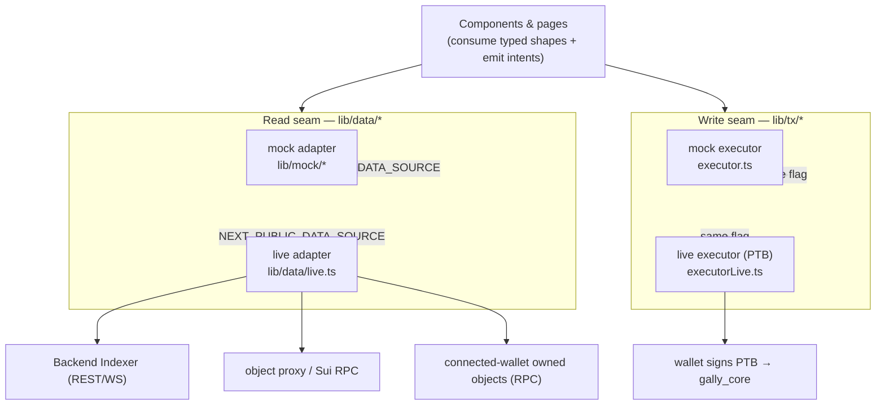

# Gally Capital Explorer (Frontend)

A public **block explorer** for the Gally protocol **and** the **investor dApp** — a window onto
real-world-asset raises, validator attestations, tranche releases, yield distribution and disputes,
plus a wallet-connected transaction layer scoped to the *user* (investor / holder / challenger) role.

> **Status (2026-06): live-capable.** The build runs on a baked-in mock dataset **by default** (so it
> builds and renders fully offline), and flips to **live data** — the [Backend Indexer](../Backend%20Indexer),
> Sui object reads, and a connected wallet — behind one env flag. Both read and write paths are live.
> Every shape in `lib/` mirrors the on-chain object model, so the mock↔live swap is mechanical and
> component code is unchanged. (Contributor notes live in `AGENTS.md`.)

## Run it

`pnpm install` then `pnpm dev` (→ `http://localhost:3000`), or `pnpm build && pnpm start`. Default is
mock data. To point at a running indexer, set `NEXT_PUBLIC_DATA_SOURCE=live` (+ the indexer base URL).

Stack: **Next.js 16 (App Router) · React 19 · Tailwind v4**. **Zero UI-library dependencies** — all
icons and charts are hand-rolled inline SVG, so it builds offline (a hard constraint of this build).

## The seam: one component tree, two data backends

The defining design choice is a **seam**: components consume typed `lib/types.ts` shapes and *intents*,
never raw rows or PTBs. A mock and a live adapter sit behind that seam, selected by env — so going live
changed **adapters only**, not pages.

### Reads — five sources behind one seam (`lib/data/*`)

Reads have multiple *sources* but one entry surface:

1. **Indexer DB** — history, time-series, discovery lists, holders, portfolio/activity, governance log
   (most of what the explorer renders).
2. **Live object reads** via the indexer's `GET /objects/:id` proxy → Sui fullnode (cached ~5s) —
   current object state: full `ProtocolConfig`, live `Asset`/`ValidatorPool`/accumulator fields, legal-doc
   dynamic fields.
3. **Walrus** (client-direct, sha256-verified) — the document *bytes*; on-chain holds only
   `blob_id + sha256` (a mock-Walrus stand-in is used until the real-Walrus layer lands).
4. **Connected-wallet owned objects** (RPC) — *your* `GallyShare` / `Coin<T>` / receipts and exact
   claimable yield (computed against the live accumulator index). `/portfolio` renders these in live mode.
5. **Frontend-derived** — values computed in-app from the above (health/solvency, risk clocks).

### Writes — one sink (`lib/tx/*`)

The component tree builds typed **intents** (one per user verb); an adapter turns them into a result.
The **mock executor** simulates `building → signing → pending → success` deterministically and applies
optimistic local state; the **live executor** builds a PTB, has the connected wallet sign it, waits for
effects, and lets the indexer/RPC reads reconcile the optimistic overlay. The explorer **never touches
keys**.

> **D-FE2 — the explorer is the user's dApp, not the operators'.** Only *user* verbs are actionable:
> **contribute · claim deeds · refund · claim yield · wrap · unwrap · split deed · raise dispute**, plus
> permissionless **cranks** (`resolve_dispute`, `flag_default`, `abort_failed_raise`, `sweep_rollover`,
> `sweep_compensation`). Entity / validator / admin verbs are **never** rendered here. Exit actions
> (refund / claim / unwrap / dispute-resolve) carry **no pause gate**, mirroring the contract (D6, I-X1).

## Routes

| Route | Purpose |
|---|---|
| `/` | Explore dashboard — TVL hero, KPIs, trending assets, sectors, top-assets table, watchlist, live activity |
| `/assets` · `/assets/[id]` | Directory (search / filter / sort) → asset detail (lifecycle, raise/yield/wrap charts, tranche engine, validator, accumulator, disputes, **actions**) |
| `/assets/[id]/holders` | Ranked holder ledger (deeds + wrapped + % of supply), protocol-attributed |
| `/tokens/[accId]` | The accumulator as a token — supply, wrap ratio, index, holders, the `Coin<T>` view |
| `/validators` · `/validators/[id]` | Registry + per-pool track record (stake, utilization, vouches, disputes) |
| `/disputes` · `/disputes/[id]` | Dispute feed → detail with jury roll-call, evidence, restitution routing |
| `/governance` | `ProtocolConfig` params, pause status, parameter-change history |
| `/address/[addr]` · `/portfolio` | Any account (holdings, roles, activity); `/portfolio` is the connected-wallet view of that surface |
| `/cranks` | Keeper page — permissionless cranks whose preconditions are currently met |
| `/activity` | Global event stream, filterable by feed |
| `/tx/[digest]` · `/objects/[id]` · `/search` | One transaction · universal ID resolver (302s to the typed page) · ⌘K search results |

## How it maps to the protocol

`lib/types.ts` mirrors the on-chain object model + event catalog; the mock dataset (`lib/mock/*`) is a
faithful, deterministic projection (fixed `NOW`, seeded PRNG — no hydration drift) used offline and as
the live-mode demo fallback. Wallet state is a small store (connected account); read pages never read
it — only the action layer and the topbar account control do.

## Build & test

`pnpm typecheck && pnpm lint && pnpm build && pnpm test && pnpm test:e2e` (Vitest unit + Playwright
e2e; `npx playwright install chromium` once). Live-mode interactive sign/submit needs a funded browser
wallet (`pnpm test:e2e:live`) and cannot run headless. Light/dark toggles in the top bar; the watchlist
persists in `localStorage`.
