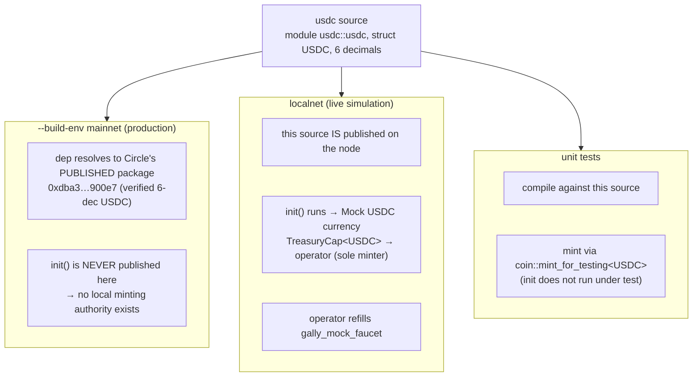

# usdc — the settlement coin type

This tiny Sui Move package exists to provide **one type**: `usdc::usdc::USDC`, the coin every other
package in Gally settles in (`Balance<USDC>`, `Coin<USDC>`). That fully-qualified path — package
`usdc`, module `usdc`, struct `USDC` — is **deliberately identical to Circle's on-chain USDC**, so
the protocol can reference the *real* USDC on mainnet and a *mintable mock* everywhere else **without
changing a single line of consuming code**.

> **Authoritative source:** the file headers in [`Move.toml`](Move.toml),
> [`Published.toml`](Published.toml), and [`sources/usdc.move`](sources/usdc.move). This README
> explains the resolution model; those headers are the contract.

## Where it sits

`gally_core` and `gally_mock_faucet` depend on this package for their settlement type. It has no
dependency on them — it is a leaf. It is the first thing published in a fresh deployment
(`run_stack.sh` / `run_devnet.sh`), because everything downstream is generic over `USDC`.

## The one mechanic: environment-dependent resolution

The same `usdc` dependency resolves to a **different on-chain package per build environment**. This
is driven by Move's `[environments]` (in `Move.toml`) and `[published.*]` (in `Published.toml`):

- **mainnet (production).** `Published.toml [published.mainnet]` points the dependency at Circle's
  already-deployed package id. A consumer compiled with `--build-env mainnet` therefore references the
  **real** Circle `USDC`; this package's `init` is never published, so there is **no** local minting
  authority. `Published.toml`'s mainnet entry is the one piece committed to source control (it is
  static production config) — which is why `.gitignore` keeps `Published.toml` ignored *except*
  `usdc/Published.toml`.
- **localnet (live simulation).** The package is published on the local/devnet node, so `init` runs:
  it creates a 6-decimal Mock USDC, **freezes** its metadata immutable, and transfers the virgin
  `TreasuryCap<USDC>` to the publisher (the Root Simulator operator), who becomes the sole minter and
  tops up `gally_mock_faucet`. `run_stack.sh` rewrites the ephemeral `[published.localnet]` entry per
  fresh chain (not committed).
- **unit tests.** Compile against this source and mint with the test-only
  `coin::mint_for_testing<USDC>`; `init` does not run under test.

> ⚠️ **"USDC is mintable" is a SIM/LOCAL build property, never a protocol property.**
> Mainnet has no local minting authority — only Circle mints real USDC. Never write
> protocol logic that assumes it can mint settlement funds.

## Why 6 decimals matters

`DECIMALS = 6` matches Circle's canonical USDC and is the same decimal count the protocol enforces on
every per-entity token at finalize (`gally_core` `EInvalidDecimals`). USDC parity is what keeps
1 share = 1 USDC exact across the whole system.

## Build

`sui move build` (add `--build-env mainnet` to type-check against Circle's published id).
